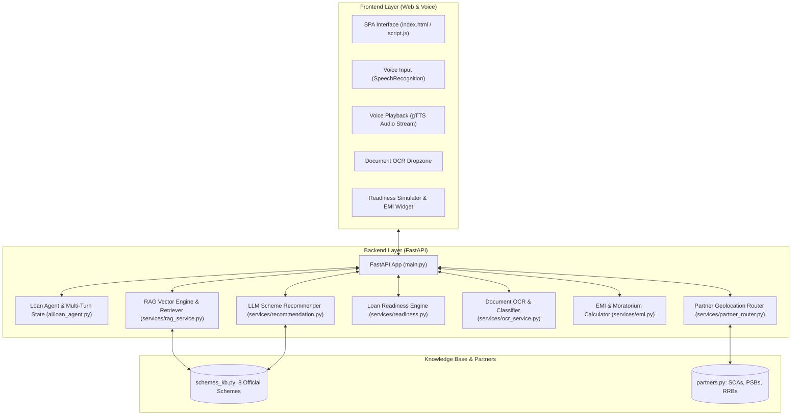

# 🏛️ YojanaSetu (योजनासेतु) — AI-Powered SC Loan Assistance Platform

[](https://www.python.org/)
[](https://fastapi.tiangolo.com/)
[](https://openrouter.ai/)
[](LICENSE)
[](#)

> **Empowering Scheduled Caste (SC) beneficiaries with accessible, voice-first, AI-driven concessional loan discovery, instant document OCR validation, and multi-factor loan readiness scoring.**

---

## 📌 Problem Statement

Millions of Scheduled Caste (SC) entrepreneurs, students, and artisans across India are eligible for highly concessional government loans (via **NSFDC** and **State Channelising Agencies**). However, they face significant roadblocks:
- **Low Literacy & Language Barriers**: Complex bureaucratic jargon and application forms in English.
- **Scheme Confusion**: Difficulty identifying which scheme best fits their specific trade, gender, or education level.
- **Documentation Rejections**: High rejection rates due to missing or unverified certificates (Caste, Income, Quotations).
- **Lack of Advisory**: Inability to estimate EMI affordability or find local channel partners.

**YojanaSetu** solves this with an empathetic, voice-first AI assistant that guides beneficiaries in spoken Hindi, recommends schemes using a grounded **RAG (Retrieval-Augmented Generation)** engine, verifies documents via **Vision OCR**, and scores loan readiness in real time.

---

## ✨ Core Features & Innovation

### 🎙️ 1. Voice-First Conversational AI Assistant
- **Bilingual & Spoken Hindi**: Speaks naturally in polite, accessible Hindi (Devanagari script) with voice synthesis (`gTTS`) and voice recognition (`Web Speech API`).
- **Smart Entity Extractor**: Automatically parses amounts in Hindi/English (*"दो लाख"*, *"2.5 lakh"*), loan categories, business purposes, and tenure.

### 🧠 2. RAG-Powered Scheme Recommendation Model
- **Official NSFDC Knowledge Base**: Indexes 8 comprehensive schemes with limits, interest rates, capital subsidies, and moratorium terms.
- **Hybrid Vector Retriever**: In-memory TF-IDF semantic vector search combined with hard eligibility constraints (amount limits, gender rebates, skill certifications).
- **Grounded LLM Reasoning**: Outputs a 0-100% match score, transparent eligibility reasons, government subsidy details, and document checklists.

### 🎯 3. Multi-Pillar Loan Readiness Score
- **100-Point Scoring Engine**:
  - **EMI Affordability (35 pts)**: Compares monthly EMI with household income.
  - **Scheme Fit & Limits (25 pts)**: Validates ceiling and income compliance.
  - **Project Viability & Purpose (20 pts)**: Evaluates trade/course legitimacy.
  - **Tenure Feasibility (10 pts)**: Ensures realistic repayment schedules.
  - **Documentation Baseline (10 pts)**: Evaluates uploaded proofs.
- Interactive SVG gauge with actionable improvement recommendations.

### 📄 4. Document OCR & Authentic Verification
- **Vision OCR Classifier**: Extracts text and validates official seals/keywords for:
  - 🆔 **SC Caste Certificate**
  - 📄 **Income Certificate (< ₹3 Lakh)**
  - 🪪 **Aadhaar / Voter ID**
  - 🏦 **Bank Passbook / IFSC**
  - 📋 **Project Report / Quotation / Admission Letter**
- Computes real-time **Document Readiness Percentage** against scheme checklists.

### 🧮 5. Moratorium-Aware EMI Calculator
- Accurately computes monthly EMI and amortization with grace periods (3–12 months moratorium).

### 📍 6. Geolocation Channel Partner Router
- Uses the **Haversine formula** to locate the nearest State Channelising Agency (SCA), Public Sector Bank (PSB), or Regional Rural Bank (RRB) with interactive map previews.

---

## 🏛️ System Architecture



---

## 📋 Supported Government Schemes

| Scheme Name | Target Beneficiary | Max Loan (₹) | Interest Rate | Moratorium | Key Benefit / Subsidy |
| :--- | :--- | :---: | :---: | :---: | :--- |
| **Mahila Samriddhi Yojana (MSY)** | SC Women / SHGs | ₹1,40,000 | 4.0% p.a. | 3 months | Up to 50% capital subsidy + 1% prompt repayment rebate |
| **Micro Credit Finance (MCF)** | Small Vendors / Artisans | ₹1,40,000 | 5.0% p.a. | 3 months | Easy quick-sanction micro credit |
| **Laghu Udhyami Yojana (LUY)** | ITI / Skilled SC Youth | ₹5,00,000 | 6.0% p.a. | 6 months | Margin money support for workshops & service centers |
| **Green Business Scheme (GBS)** | E-Rickshaw / Solar Units | ₹30,00,000 | 6.0% p.a. | 6 months | Clean energy & EV subsidy |
| **Term Loan Scheme** | Medium / Large Commercial Units | ₹50,00,000 | 7.0% p.a. | 6 months | Up to 95% project cost coverage |
| **Educational Loan (ELIS India)** | Higher Education in India | ₹20,00,000 | 4.0% p.a. | 12 months | Central Sector Interest Subsidy (CSIS) during study |
| **Educational Loan Abroad** | Foreign Masters / PhD / STEM | ₹30,00,000 | 4.0% p.a. | 12 months | Subsidized rate with NOS scholarship linkage |
| **Stand-Up India (SC Category)** | Greenfield Enterprises | ₹1,00,00,000 | 7.5% p.a. | 18 months | Collateral-free CGSSI credit guarantee |

---

## 🛠️ Tech Stack

- **Backend**: Python 3.10+, FastAPI, Uvicorn, Pydantic v2, `python-dotenv`, `gTTS`, `Pillow`, `openai` SDK.
- **Frontend**: Vanilla HTML5, Modern CSS (Glassmorphism & Flex/Grid), JavaScript (ES6+), Web Speech API, Leaflet Maps.
- **AI & RAG**: OpenRouter API (`gpt-4o-mini`), In-Memory TF-IDF Vector Index, OCR Heuristics.

---

## 🚀 Quickstart Guide

### Prerequisites
- Python 3.10 or higher
- Git

### 1. Clone Repository
```bash
git clone https://github.com/goelmanan-hub/SC-Loan-Platform.git
cd SC-Loan-Platform
```

### 2. Set Up Virtual Environment & Dependencies
```bash
# Navigate to backend
cd backend

# Create virtual environment
python -m venv venv

# Activate virtual environment
# Windows:
.\venv\Scripts\activate
# macOS / Linux:
source venv/bin/activate

# Install dependencies
pip install -r requirements.txt
```

### 3. Configure Environment Variables
Create a `.env` file in the `backend/` folder:
```env
OPENROUTER_API_KEY=your_openrouter_api_key_here
```
*(Note: The platform features automated deterministic fallbacks and operates smoothly even in offline/demo mode without an API key).*

### 4. Run the Application
```bash
python -m uvicorn main:app --reload --port 8000
```

### 5. Access the Web Application
Open your browser and navigate to:
👉 **[http://127.0.0.1:8000/app/index.html](http://127.0.0.1:8000/app/index.html)**

Interactive API Documentation (Swagger):
👉 **[http://127.0.0.1:8000/docs](http://127.0.0.1:8000/docs)**

---

## 📡 API Reference

| Method | Endpoint | Description |
| :---: | :--- | :--- |
| `GET` | `/api/schemes` | Returns all 8 indexed SC loan schemes. |
| `POST` | `/api/recommend-scheme` | Executes the RAG pipeline to recommend schemes + readiness score. |
| `POST` | `/api/calculate-readiness` | Standalone 5-pillar Loan Readiness Score evaluator. |
| `POST` | `/api/verify-documents` | Multi-file OCR upload & scheme document checklist verification. |
| `POST` | `/api/calculate-emi` | Concessional EMI and total interest calculator. |
| `POST` | `/api/find-partners` | Nearest channel partner discovery via latitude/longitude. |
| `POST` | `/api/ai/new-session` | Initiates a new multi-turn conversation session. |
| `POST` | `/api/conversation/answer` | Multi-turn conversational voice/text handler with entity extraction. |
| `GET` | `/api/tts` | Dynamic Hindi text-to-speech audio generator. |

---

## 📂 Project Structure

```
SC-Loan-Platform/
├── README.md                           # Comprehensive documentation
├── backend/
│   ├── main.py                         # FastAPI master application & endpoints
│   ├── requirements.txt                # Python backend dependencies
│   ├── .env                            # Environment variables (OpenRouter key)
│   ├── ai/
│   │   └── loan_agent.py               # Conversational AI assistant & prompt engineering
│   ├── data/
│   │   ├── schemes_kb.py               # Official 8 NSFDC scheme knowledge base
│   │   ├── schemes.py                  # Backward-compatible scheme router
│   │   └── partners.py                 # Channel partner dataset (SCAs, PSBs, RRBs)
│   ├── models/
│   │   └── schemas.py                  # Pydantic request/response models
│   └── services/
│       ├── rag_service.py              # RAG Vector store, TF-IDF engine & hybrid retriever
│       ├── recommendation.py           # Grounded RAG recommender & fallback
│       ├── readiness.py                # 100-point multi-factor readiness score engine
│       ├── ocr_service.py              # Vision OCR & document checklist validation
│       ├── emi.py                      # Moratorium & concessional EMI calculations
│       ├── partner_router.py           # Haversine geolocation router
│       └── conversation.py             # Chat session state manager
└── frontend/
    ├── index.html                      # Single-page application markup
    ├── style.css                       # Responsive styling, gauges & theme
    └── script.js                       # Web Speech API, OCR, Simulator & API client
```

---

## 👥 Contributors & Acknowledgements

Developed for the **Financial Inclusion & Concessional Lending Hackathon** to empower Scheduled Caste (SC) beneficiaries across India.

- **NSFDC** (National Scheduled Castes Finance and Development Corporation)
- **Ministry of Social Justice and Empowerment, Government of India**
