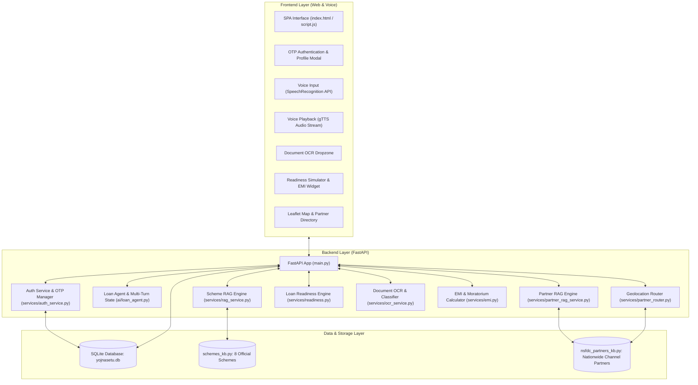

# 🏛️ YojanaSetu (योजनासेतु) — AI-Powered SC Loan Assistance Platform

[](https://www.python.org/)
[](https://fastapi.tiangolo.com/)
[](https://www.sqlite.org/)
[](https://openrouter.ai/)
[](LICENSE)
[](#)

> **Empowering Scheduled Caste (SC) beneficiaries across India with voice-first conversational AI, secure OTP-authenticated profiles, RAG-driven NSFDC loan discovery, instant document OCR validation, multi-pillar readiness scoring, and nationwide channel partner routing.**

---

## 📌 Problem Statement

Millions of Scheduled Caste (SC) entrepreneurs, students, women artisans, and small business owners across India are eligible for highly concessional government loans (via **NSFDC** and **State Channelising Agencies**). However, they encounter critical barriers:
- **Language & Literacy Barriers**: Bureaucratic documentation and application procedures predominantly in English or dense legal terminology.
- **Scheme Discovery Complexity**: Difficulty pinpointing the exact scheme tailored to their specific trade, income bracket, gender, or educational qualifications.
- **High Document Rejection Rates**: Applications get delayed or rejected due to unverified or missing certificates (Caste, Income, Bank Passbook, Quotation).
- **Advisory & Last-Mile Reach**: Lack of knowledge on local State Channelising Agencies (SCAs), Regional Rural Banks (RRBs), or Public Sector Banks (PSBs).

**YojanaSetu** bridges this gap with an empathetic, bilingual voice-first AI platform that speaks natural Hindi, performs grounded **RAG (Retrieval-Augmented Generation)** recommendations, verifies documents via **Vision OCR**, computes loan readiness scores, and connects applicants to their closest verified financial partner.

---

## ✨ Core Features & Capabilities

### 🎙️ 1. Voice-First Conversational AI Assistant
- **Bilingual & Spoken Hindi**: Speaks naturally in polite, accessible Hindi (Devanagari script) with voice synthesis (`gTTS`) and browser voice recognition (`Web Speech API`).
- **Entity & Intent Extractor**: Automatically parses amounts in Hindi/English (*"दो लाख"*, *"2.5 lakh"*), loan categories, business trades, tenures, and applicant details.

### 🔐 2. Secure OTP Authentication & Persistence Layer
- **Multi-Channel OTP Verification**: Time-bounded 6-digit OTP verification via simulated SMS and Email gateways.
- **Persistent SQLite Database**: Automatically manages user profiles, verified applicant statuses, multi-pillar loan assessment histories, and conversation audit trails.
- **Saved Assessments Dashboard**: Beneficiaries can track previous loan evaluations and readiness scores across sessions.

### 🧠 3. RAG-Powered Scheme Recommendation Model
- **Official NSFDC Knowledge Base**: Indexes comprehensive concessional schemes with limits, interest rates, capital subsidies, and moratorium terms.
- **Hybrid Vector Retriever**: TF-IDF semantic vector search combined with hard eligibility constraints (amount ceilings, gender rebates, skill certifications).
- **Grounded LLM Reasoning**: Outputs a 0–100% match score, transparent eligibility justifications, government subsidy calculations, and document checklists.

### 🎯 4. 100-Point Multi-Pillar Loan Readiness Score
- **Multi-Factor Assessment Engine**:
  - **EMI Affordability (35 pts)**: Compares estimated monthly EMI against household income.
  - **Scheme Fit & Limits (25 pts)**: Validates ceiling and income criteria compliance.
  - **Project Viability & Purpose (20 pts)**: Evaluates trade legitimacy and business potential.
  - **Tenure Feasibility (10 pts)**: Ensures realistic repayment schedules.
  - **Documentation Baseline (10 pts)**: Evaluates uploaded proofs and certificates.
- Interactive visual SVG gauge with actionable recommendations to maximize loan approval odds.

### 📄 5. Document OCR & Verification Pipeline
- **Vision OCR Classifier**: Extracts text and validates official keywords/seals for:
  - 🆔 **SC Caste Certificate**
  - 📄 **Income Certificate (< ₹3 Lakh)**
  - 🪪 **Aadhaar / Voter ID**
  - 🏦 **Bank Passbook / IFSC**
  - 📋 **Project Report / Quotation / Admission Letter**
- Computes real-time **Document Readiness Percentage** against scheme checklists.

### 📍 6. Nationwide Partner RAG & Geolocation Router
- **Comprehensive Partner Knowledge Base (`nsfdc_partners_kb.py`)**: Covers State Channelising Agencies (SCAs), Lead District Banks, Regional Rural Banks (RRBs), and Public Sector Banks (PSBs) across Indian states/districts.
- **Hybrid Geo + Semantic Search**: Finds the nearest partner using the **Haversine formula** and provides semantic district/state queries with instant Leaflet map integration and branch contact details.

---

## 🏛️ System Architecture



---

## 📋 Supported Government Schemes

| Scheme Name | Target Beneficiary | Max Loan (₹) | Interest Rate | Moratorium | Key Benefit / Subsidy |
| :--- | :--- | :---: | :---: | :---: | :--- |
| **Mahila Samriddhi Yojana (MSY)** | SC Women / SHGs | ₹1,40,000 | 4.0% p.a. | 3 months | Up to 50% capital subsidy + 1% prompt repayment rebate |
| **Micro Credit Finance (MCF)** | Small Vendors / Artisans | ₹1,40,000 | 5.0% p.a. | 3 months | Quick-sanction micro credit with minimal paperwork |
| **Laghu Udhyami Yojana (LUY)** | ITI / Skilled SC Youth | ₹5,00,000 | 6.0% p.a. | 6 months | Margin money support for workshops & service centers |
| **Green Business Scheme (GBS)** | E-Rickshaw / Solar Units | ₹30,00,000 | 6.0% p.a. | 6 months | Clean energy & EV transport subsidy |
| **Term Loan Scheme** | Commercial & Service Units | ₹50,00,000 | 7.0% p.a. | 6 months | Up to 95% project cost coverage |
| **Educational Loan (ELIS India)** | Higher Education in India | ₹20,00,000 | 4.0% p.a. | 12 months | Central Sector Interest Subsidy (CSIS) during study |
| **Educational Loan Abroad** | Foreign Masters / PhD / STEM | ₹30,00,000 | 4.0% p.a. | 12 months | Subsidized rate with NOS scholarship linkage |
| **Stand-Up India (SC Category)** | Greenfield Enterprises | ₹1,00,00,000 | 7.5% p.a. | 18 months | Collateral-free CGSSI credit guarantee support |

---

## 🛠️ Tech Stack

- **Backend**: Python 3.10+, FastAPI, Uvicorn, SQLite 3, Pydantic v2, `python-dotenv`, `gTTS`, `Pillow`, `openai` SDK.
- **Frontend**: HTML5, Modern Responsive CSS (Glassmorphism, Flex/Grid), Vanilla JavaScript (ES6+), Web Speech API, Leaflet Maps.
- **AI & RAG**: OpenRouter API (`gpt-4o-mini`), In-Memory TF-IDF Vector Indices, Document OCR Parser.
- **Security & Storage**: Secure OTP generation, SQLite relational persistence.

---

## 🚀 Quickstart Guide

### Prerequisites
- Python 3.10 or higher
- Git

### 1. Clone Repository
```bash
git clone https://github.com/goelmanan-hub/SC-Loan-Platform.git
cd SC-Loan-Platform
```

### 2. Set Up Virtual Environment & Dependencies
```bash
# Navigate to backend
cd backend

# Create virtual environment
python -m venv venv

# Activate virtual environment
# Windows:
.\venv\Scripts\activate
# macOS / Linux:
source venv/bin/activate

# Install dependencies
pip install -r requirements.txt
```

### 3. Configure Environment Variables
Create a `.env` file in the `backend/` folder:
```env
OPENROUTER_API_KEY=your_openrouter_api_key_here
```
*(Note: The platform features automated deterministic fallbacks and operates smoothly in offline/demo mode even without an API key).*

### 4. Run the Application
```bash
python -m uvicorn main:app --reload --port 8000
```

### 5. Access the Web Application
Open your browser and navigate to:
👉 **[http://127.0.0.1:8000/app/index.html](http://127.0.0.1:8000/app/index.html)**

Interactive API Documentation (Swagger):
👉 **[http://127.0.0.1:8000/docs](http://127.0.0.1:8000/docs)**

---

## 📡 API Reference

### 🔐 Authentication & User Profile
| Method | Endpoint | Description |
| :---: | :--- | :--- |
| `POST` | `/api/auth/send-otp` | Generates and sends a 6-digit OTP to phone/email. |
| `POST` | `/api/auth/verify-otp` | Validates OTP and registers/logs in the applicant. |
| `GET` | `/api/auth/profile` | Fetches applicant profile & verification badge status. |

### 📊 Assessments & Persistence
| Method | Endpoint | Description |
| :---: | :--- | :--- |
| `POST` | `/api/assessments/save` | Saves loan readiness score and recommended scheme to SQLite. |
| `GET` | `/api/assessments/my` | Retrieves historical saved assessments for an applicant. |

### 🧠 Loan AI & RAG Discovery
| Method | Endpoint | Description |
| :---: | :--- | :--- |
| `GET` | `/api/schemes` | Returns all 8 indexed SC loan schemes with details. |
| `POST` | `/api/recommend-scheme` | Executes the Scheme RAG pipeline + readiness score. |
| `POST` | `/api/calculate-readiness` | Evaluates 100-point 5-pillar Loan Readiness Score. |
| `POST` | `/api/verify-documents` | Multi-file OCR upload & scheme checklist verification. |
| `POST` | `/api/calculate-emi` | Concessional EMI and moratorium amortization calculator. |
| `POST` | `/api/ai/new-session` | Initiates a new multi-turn conversation session. |
| `POST` | `/api/conversation/answer` | Multi-turn conversational voice/text handler with entity extraction. |
| `GET` | `/api/tts` | Dynamic Hindi text-to-speech audio generator. |

### 📍 Channel Partner RAG & Geolocation
| Method | Endpoint | Description |
| :---: | :--- | :--- |
| `GET` | `/api/partners/all` | Returns list of all indexed channel partners. |
| `GET` | `/api/partners/states` | Returns list of unique states covered. |
| `POST` | `/api/find-partners` | Haversine nearest partner search via coordinates. |
| `POST` | `/api/partners/rag-search` | Semantic RAG partner query matching across states/districts. |

---

## 📂 Project Structure

```
SC-Loan-Platform/
├── README.md                           # Comprehensive documentation
├── .gitignore                          # Git ignore rules (DBs, envs, caches)
├── backend/
│   ├── main.py                         # FastAPI master application & endpoints
│   ├── requirements.txt                # Python backend dependencies
│   ├── .env                            # Environment variables (OpenRouter key)
│   ├── test_full_system.py             # E2E system integration verification script
│   ├── test_auth_and_db.py             # OTP auth & SQLite persistence test suite
│   ├── test_partner_rag.py             # Channel Partner RAG search test suite
│   ├── ai/
│   │   └── loan_agent.py               # Conversational AI assistant & prompt engineering
│   ├── data/
│   │   ├── schemes_kb.py               # Official 8 NSFDC scheme knowledge base
│   │   ├── schemes.py                  # Backward-compatible scheme router
│   │   ├── nsfdc_partners_kb.py        # Nationwide Channel Partner Knowledge Base (36+ States/UTs)
│   │   └── partners.py                 # Channel partner dataset (SCAs, PSBs, RRBs)
│   ├── database/
│   │   ├── __init__.py                 # Database package initializer
│   │   └── db.py                       # SQLite persistence layer (users, OTPs, assessments)
│   ├── models/
│   │   └── schemas.py                  # Pydantic request/response schemas
│   └── services/
│       ├── auth_service.py             # OTP generation, dispatch & verification service
│       ├── rag_service.py              # Scheme RAG Vector store, TF-IDF engine & retriever
│       ├── partner_rag_service.py      # Channel Partner RAG search & semantic matcher
│       ├── recommendation.py           # Grounded RAG recommender & fallback
│       ├── readiness.py                # 100-point multi-factor readiness score engine
│       ├── ocr_service.py              # Vision OCR & document checklist validation
│       ├── emi.py                      # Moratorium & concessional EMI calculations
│       ├── partner_router.py           # Geolocation & partner routing service
│       └── conversation.py             # Multi-turn chat session state manager
└── frontend/
    ├── index.html                      # Single-page application markup
    ├── style.css                       # Responsive styling, modern UI & dark mode accents
    └── script.js                       # Voice assistant, OTP auth, Leaflet maps, simulator & OCR client
```

---

## 👥 Contributors & Acknowledgements

Developed for the **Financial Inclusion & Concessional Lending Hackathon** to empower Scheduled Caste (SC) beneficiaries across India.

- **NSFDC** (National Scheduled Castes Finance and Development Corporation)
- **Ministry of Social Justice and Empowerment, Government of India**
